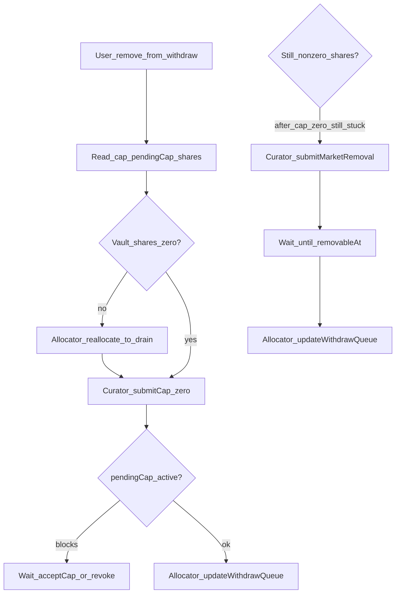

# Vault Management — plan funkcjonalny i techniczny

## Źródło prawdy: SiloVault (silo-vaults)

Kontrakt `[SiloVault.sol](https://github.com/silo-finance/silo-contracts-v3/blob/develop/silo-vaults/contracts/SiloVault.sol)` i biblioteka `[SiloVaultActionsLib.sol](https://github.com/silo-finance/silo-contracts-v3/blob/develop/silo-vaults/contracts/libraries/SiloVaultActionsLib.sol)` definiują całą logikę kolejek, capów i usuwania. Interfejs `[ISiloVault.sol](https://github.com/silo-finance/silo-contracts-v3/blob/develop/silo-vaults/contracts/interfaces/ISiloVault.sol)` jest minimalnym zestawem wywołań do odczytu i planowania transakcji.

### Role (kto wywołuje z Safe)

| Rola          | Typowe wywołania istotne dla tej strony                                              |
| ------------- | ------------------------------------------------------------------------------------ |
| **Owner**     | m.in. `setCurator`, `setIsAllocator`, `submitTimelock`, `acceptTimelock`             |
| **Curator**   | `submitCap`, `submitMarketRemoval`, `revokePendingCap`, `revokePendingMarketRemoval` |
| **Allocator** | `setSupplyQueue`, `updateWithdrawQueue`, `reallocate`                                |
| **Guardian**  | m.in. `revokePendingTimelock`, `revokePendingCap` (wspólnie z kuratorem)             |

Strona nie wysyła tx — tylko pokazuje **co** i **kto** powinien wywołać.

### Odczyty potrzebne do UI

- `asset()`, `timelock()`, `curator()`, `owner()` (np. do kontekstu multisiga).
- `supplyQueue(i)` / `supplyQueueLength()`, `withdrawQueue(i)` / `withdrawQueueLength()`.
- Dla każdego adresu marketu (`IERC4626`): `config(market)` → `(cap, enabled, removableAt)` oraz `pendingCap(market)` → `(value, validAt)`, `balanceTracker(market)` (przydatne do diagnostyki vs `previewRedeem(balanceOf)`).
- Opcjonalnie `pendingTimelock` jeśli kiedyś rozszerzycie nagłówek o zmianę timelocku vaultu.

### Rozpoznanie **Idle vault** vs zwykły market

`[IdleVault.sol](https://github.com/silo-finance/silo-contracts-v3/blob/develop/silo-vaults/contracts/IdleVault.sol)` ma `ONLY_DEPOSITOR` ustawiane przy deployu z `[IdleVaultsFactory` przez `SiloVaultDeployer](https://github.com/silo-finance/silo-contracts-v3/blob/develop/silo-vaults/contracts/SiloVaultDeployer.sol)` na adres **tego samego** SiloVault. Heurystyka UI:

1. Wywołaj `ONLY_DEPOSITOR()` — jeśli zwraca adres wprowadzonego vaultu → **Idle market**.
2. Dodatkowo `asset()` IdleVault = `asset()` SiloVault (ten sam underlying).

Etykieta: np. „Idle” / „Idle (ASSET_SYMBOL)” zamiast pary BTC/USDC.

### Etykieta marketu „BTC/USDC” (Silo jako `IERC4626`)

Markety w kolejkach to adresy kontraktów zgodnych z `IERC4626` (w praktyce silosy z silo-core). Tu wykorzystać istniejące w projekcie odczyty `[ISiloConfig](src/abis/silo/ISiloConfig.json)` / logikę typu `[fetchMarketConfig](src/utils/fetchMarketConfig.ts)`: z adresu silo → `token0` / `token1` (lub odpowiednie gettery używane już przy weryfikacji rynku) → symbole ERC20. Dla Idle pominąć parę i pokazać pojedynczy asset vaultu.

---

## Kolejki: semantyka (withdraw vs supply)

- **Supply queue** — kolejność, w jakiej nowe depozyty **rozlewają** środki po marketach (pomijane są pozycje z `cap == 0`). Ustawiana **całym** tablicą: `setSupplyQueue(IERC4626[])` — *allocator*.
- **Withdraw queue** — kolejność **wypłat** z marketów przy redeem/withdraw użytkowników vaultu. **Nie można dodawać** nowych marketów tą funkcją — tylko permutacja i usunięcie: `updateWithdrawQueue(uint256[] indexes)` — *allocator*. Indeksy to permutacja indeksów **poprzedniej** kolejki (patrz komentarz w `ISiloVault`: *not idempotent*).

### Wymagania operacyjne (Idle)

- **Withdraw queue:** Idle **pierwszy** (indeks 0).
- **Supply queue:** Idle **ostatni**.

UI powinno oznaczać naruszenia jako ostrzeżenie + sugerowana poprawka w sekcji synchronizacji.

---

## Usuwanie marketu z listy — pełna specyfikacja kroków

Operacja zależy od tego, **z której listy** usuwamy i jaki jest **stan on-chain**.

### A) Usunięcie z **supply queue** (nie dotyka withdraw queue ani cap)

- **Kto:** allocator.
- **Co:** `setSupplyQueue(newQueue)` — nowa tablica **bez** tego marketu.
- **Warunek:** każdy market pozostający w `newQueue` musi mieć `config(market).cap > 0` (`validateSupplyQueue` w lib).
- **Timelock vaultu:** nie dotyczy samej kolejki supply.
- **Uwaga:** market może nadal być w withdraw queue i mieć cap > 0; tylko przestaje dostawać nowe alokacje z depozytów według tej kolejki.

### B) Usunięcie z **withdraw queue** (faktyczne „wypisanie” marketu z vaultu)

Kontrakt usuwa wpis z `config` tylko gdy market **wypada** z wyniku `updateWithdrawQueue` — patrz `SiloVaultActionsLib.updateWithdrawQueue`.

Dla każdego marketu **usuniętego** z nowej kolejki musi zachodzić:

1. `config(market).cap == 0` — w przeciwnym razie `InvalidMarketRemovalNonZeroCap`.
2. `pendingCap(market).validAt == 0` — w przeciwnym razie `PendingCap`.
3. Stan udziałów vaultu na tym ERC4626:
  - Jeśli `IERC4626(market).balanceOf(siloVault) == 0` → **nie** wymaga `removableAt`; wystarczy spełnić 1–2 i wywołać `updateWithdrawQueue`.
  - Jeśli **niezerowe** udziały:
    - Albo **najpierw** opróżnić pozycję (patrz krok C), potem jak wyżej z zerowym balansem,
    - Albo **ścieżka awaryjna:** `submitMarketRemoval` + odczekanie `removableAt` + `updateWithdrawQueue` (wg komentarzy w `ISiloVault` — ryzyko dla NAV / „twardy” removal).

### C) Ścieżka „miękka” przed usunięciem z withdraw queue (zalecana)

Cel: **zero** udziałów vaultu na marketcie, **cap = 0**, brak pending cap.

1. **(Allocator)** `reallocate(MarketAllocation[])` — wycofać środki z tego marketu i rozdzielić na inne / idle tak, by suma withdraw = supply (ostatni krok często z `assets = type(uint256).max` zgodnie z dokumentacją interfejsu). To jest natywna funkcja SiloVault; **PublicAllocator** jest osobnym kontraktem opakowującym podobne operacje z dodatkową logiką — dla waszej implementacji **nie** trzeba go wywoływać; wystarczy opisać `reallocate` jako narzędzie allocatora.
2. **(Curator)** `submitCap(market, 0)` — **obniżenie cap jest natychmiastowe** (gałąź `_newSupplyCap < supplyCap` w `submitCap` woła `_setCap` od razu; timelock dotyczy **zwiększania** cap przez `pendingCap` + `acceptCap`).
3. Sprawdzić on-chain: `balanceOf(market)` vaultu == 0. Jeśli tak → **(Allocator)** `updateWithdrawQueue` z indeksami pomijającymi ten market.
4. Jeśli nadal niezerowy balans (np. problemy z płynnością / revert) — dopiero wtedy rozważyć `submitMarketRemoval` (curator), odczekać `removableAt` (timestamp z `config.removableAt`), potem `updateWithdrawQueue`.

### Zależności / blokady

- `submitMarketRemoval` **revert**, jeśli: `removableAt != 0`, `cap != 0`, market nie `enabled`, jest `pendingCap`, itd. (`submitMarketRemoval` w lib).
- Nie można „nadpisać” pending cap bez `revokePendingCap` (guardian/curator) lub wykonania `acceptCap` po czasie.

### Mapowanie na UI (krzyżyk przy wierszu)

Po kliknięciu:

1. Określić listę: supply vs withdraw.
2. Pobrać aktualny stan: `cap`, `pendingCap`, `balanceOf(market)` vaultu, `removableAt`, ewentualnie `enabled`.
3. Zbudować **listę kroków** (numbered), każdy z: nazwa funkcji, rola, krótki opis, warunek „gotowe” sprawdzany read-only.
4. Dla kroków czasowych pokazać **deadline**: `validAt` / `removableAt` vs `block.timestamp` (z RPC).

---

## Synchronizacja marketów / kolejek

**Porównanie zbiorów (multizbiór adresów, kolejność nieistotna):**

- `S_supply` = zbiór adresów w supply queue (uwzględnić duplikaty w supply jako osobne pozycje lub znormalizować do set — użytkownik chce **unikalne** markety do porównania; zalecam **set** dla porównania „czy te same rynki”, plus osobno pokazać duplikaty w supply jako ostrzeżenie).
- `S_withdraw` = zbiór adresów w withdraw queue.
- Jeśli `S_supply === S_withdraw` → komunikat: **listy są identyczne jako zbiory** (z opcjonalnym ostrzeżeniem o duplikatach tylko po stronie supply).
- Jeśli różne → przyciski / sekcja **„Synchronize queues”** z propozycją docelowych tablic:
  - **Withdraw:** `[idle, ...pozostałe unikalne poza idle w ustalonej kolejności]` — kolejność „pozostałych” można ustalić alfabetycznie po adresie lub obecną koleją withdraw jako domyślną.
  - **Supply:** `[...pozostałe, idle]` — to samo.
- Dla każdej proponowanej zmiany wylistować **konkretne tx**: `setSupplyQueue(...)`, `updateWithdrawQueue([...])` z wygenerowanymi indeksami z aktualnej withdraw queue.

**Ostrzeżenia:**

- `updateWithdrawQueue` nie jest idempotent — podwójne wykonanie tej samej kalibracji zmieni kolejkę ponownie; w how-to krótko to zanotować.
- Limity długości: `MAX_QUEUE_LENGTH = 30` (`[ConstantsLib.sol](https://github.com/silo-finance/silo-contracts-v3/blob/develop/silo-vaults/contracts/libraries/ConstantsLib.sol)`).

---

## Śledzenie postępu (zielony ptaszek)

Dla każdego kroku typu „pending → accept”:

- **Zwiększenie cap:** `pendingCap.validAt > now` → krok „poczekaj”; `validAt <= now` → krok „`acceptCap(market)`”; po akceptacji `pendingCap` skasowane.
- **Usunięcie z withdraw przy niezerowym supply:** `removableAt > now` → czekanie; `removableAt <= now` → możliwy `updateWithdrawQueue`.
- **reallocate / zerowy balans:** sprawdzenie `balanceOf` i ewentualnie `previewRedeem` vs `expectedSupplyAssets` (dla spójności z tym jak liczy vault).

---

## Integracja w silo-market-crafter

- **Routing:** nowy segment jak [src/app/irm-verification/page.tsx](src/app/irm-verification/page.tsx) → np. `src/app/vault-management/page.tsx` + komponent `VaultManagementPage.tsx`.
- **Nawigacja:** dodać link w [src/components/Header.tsx](src/components/Header.tsx) (wzór „Verify IRM Update”).
- **RPC / sieć:** pole wyboru łańcucha + vault address (jak w innych narzędziach); `ethers`/`JsonRpcProvider` read-only.
- **ABI:** dodać wycinek ABI SiloVault (min. funkcje view + sygnatury potrzebne do opisu kroków) oraz minimalny ABI IdleVault (`ONLY_DEPOSITOR`) + standardowy `IERC4626` / `IERC20` dla `asset` i `balanceOf`.
- **Silo core:** ponownie użyć istniejących ABI i resolverów konfiguracji rynku do dwóch symboli — bez duplikacji logiki biznesowej wizarda.

---

## Diagram przepływu (usuwanie z withdraw — ścieżka miękka)

---

## Referencje zewnętrzne

- Repozytorium: [silo-finance/silo-contracts-v3](https://github.com/silo-finance/silo-contracts-v3) (pakiet `silo-vaults`).
- Kontekst produktowy: [Setting up your Vault | Silo V3](http://docs.silo.finance/docs/vaults/manager-guide/setting-up-your-vault/) (idle market, kolejki).

